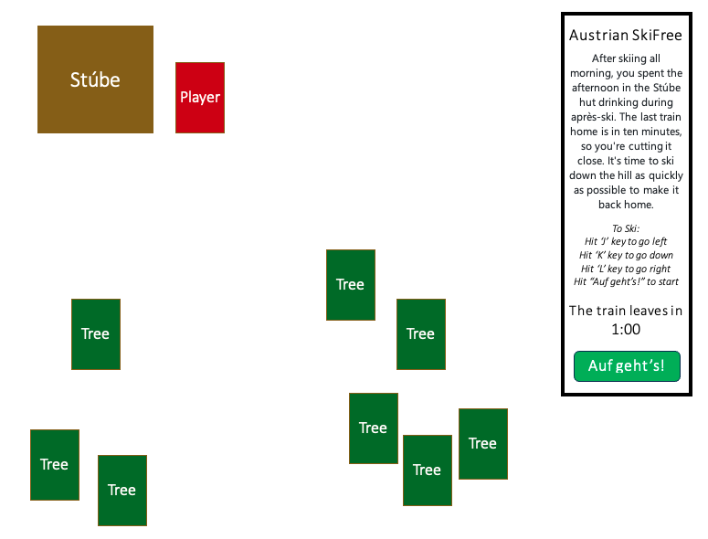
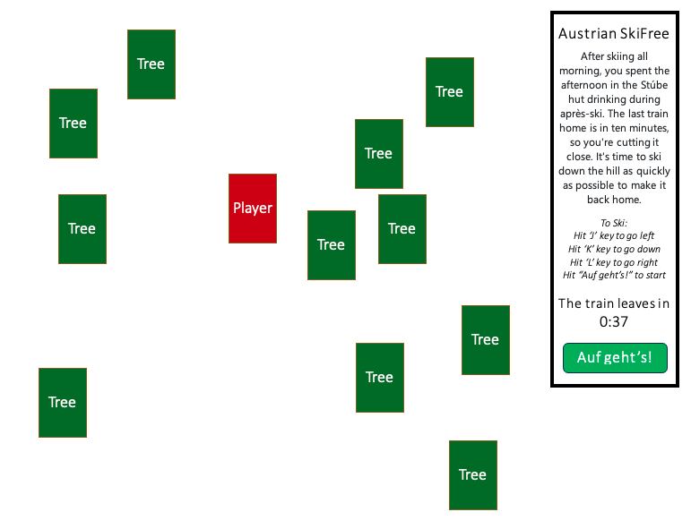
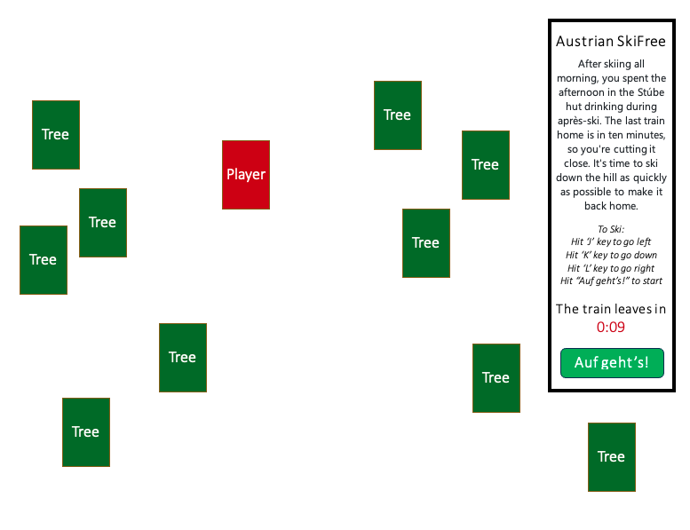
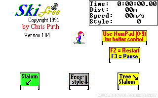

# **Project 1 - A Browser Based Game**
Created by Leah Livingston

### **An elevator pitch of your game idea**

Do you remember Chris Pirih's classic 1991 computer game ["SkiFree"](https://classicreload.com/win3x-skifree.html#)? If you enjoyed running from the abominal snowman back then, you'll love this version set in the Austrian Alps!

Click the ["Auf geht's!"](https://www.gymglish.com/en/wunderbla/german-vocabulary/auf-gehts) button when you're ready to ski.
You've won when your skier makes it to the bottom of the ski slope just in time to make the train home!

###### Setting the scene
After skiing all morning, you spent the afternoon in the Stúbe hut drinking during après-ski. The last train home is in ten minutes, so you're cutting it close. It's time to ski down the hill as quickly as possible to make it back home.

###### The goal
Ski down the slope in time to make the last train home. 

###### How to play
Use the left, right, and down arrow keys on your keyboard to navigate down the ski slope.

###### How to win
Ski down the hill in under one minute, and you win!

### **What tech stack you plan on using (example: using Tailwind for styling)**

This game is built using HTML, CSS, JavaScript & Canvas.

### **Wireframes of your game**
The minimum viable product (MVP) goal is for the user interface to show basic CSS in order for a functional game to be played.

###### Starting Screen

###### During Gameplay

###### End Screens for Winner vs. Loser

The stretch goal is for the user interface and experience to mimic the graphics and style of the original computer game from 1991.

### **MVP Goals**

###### Style
- [ ] Includes basic CSS in block form to ensure functionality works

###### Functionality
- [ ] Includes a start button to activate the beginning of the game
- [ ] Include one player functionality
- [ ] Include function to allow player to move via the keyboard's arrow keys (or using the computer mouse)
- [ ] Include obstacles (placed randomly) 
- [ ] Include countdown timer
- [ ] Include finish line for player to win
- [ ] Include a start over button to reset game from the top

### **Stretch Goals**

###### Style
- Includes CSS & Canvas styling to match that of SkiFree

###### Functionality
- Include health score tracker with three (3) lives, meaning with each crash, you lose one life.
- Ability to pick up a pretzel or beer on the way down to  add another life.
- Include moving obstacles i.e. other skiers/snowboarders, animals, etc.
- Include immediate 'game over' function by triggering an avalanche
- Ability to choose your player "Johannes" or "Katarina"
- Option to race computer player down the hill
- Ability to play on mobile (reacts to touch events)

### **Any potential roadblocks**
- How to create a gameboard that is longer than the screen seen at the start

