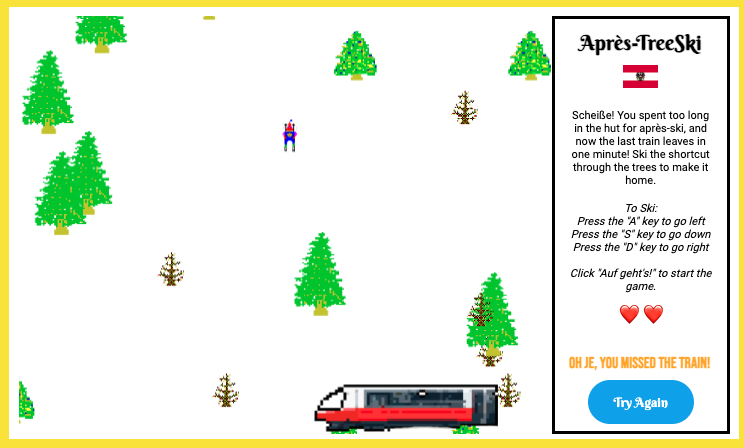

# **Après-TreeSki**
 A browser based game created by Leah Livingston

---
Do you remember Chris Pirih's classic 1991 computer game ["SkiFree"](https://classicreload.com/win3x-skifree.html#)? If you enjoyed running from the abominal snowman back then, you'll love this version set in the Austrian Alps!

###### Let's set the scene...
[Oh je!](https://www.gymglish.com/en/wunderbla/german-vocabulary/oh-je) After skiing all morning, you spent the entire afternoon in the Stúbe hut during après-ski. The last train home is in one minute, so you're cutting it close. To make the train, you'll have to take a shortcut through the trees; and let's just say, you're not in your best "state-of-mind" to ski well.🍻🥴

###### Your goal?
Ski the shortcut through the trees to make the last train home. 

###### How to play
Click the ["Auf geht's!"](https://www.gymglish.com/en/wunderbla/german-vocabulary/auf-gehts) button and hold down the "S" key when you're ready to ski. To navigate, press the "A" key to turn left, the "D" key to turn right. Don't be afraid to test out key presses... there might be a few surprises built in for you to find!

###### How to win
You've won when your skier makes it to the bottom of the ski slope and onto the train in under one minute. If you hit three trees on the way down or don't reach the train, you lose.

[Click Here to Play the Game Now](https://lvlivingston.github.io/p1-project/)

---
### Screenshots of the Game

###### Game Start

###### During Gameplay

###### End Options (Winner vs. Two Losing Options)

---
### **Tech Stack** 
This game was built using HTML, CSS, vanilla JavaScript & Canvas.

---
### **Next Steps**

###### Short-Term Stretch Goals
- [ ] Adjust responsiveness for additional screen sizes
- [ ] Adjust user experience, so train scrolls up onto screen rathering than appearing
- [ ] Adjust collision detection functions to match exact image sizes (i.e. triangle trees), rather than current square boxes
- [ ] Ability to pick up a pretzel or beer on the way down to gain an additional life

###### Long-Term Stretch Goals
- [ ] Add noises for when you hit a tree and ski, as well as music at the end
- [ ] Adjust canvas to scroll left and right to add more surprise finds
- [ ] Ability to play using the computer mouse
- [ ] Ability to play on mobile (reacts to touch events)
- [ ] Include moving obstacles i.e. other skiers/snowboarders, animals, etc.
- [ ] Add point system based on number of wins, speed, and surprise finds
- [ ] Include immediate 'game over' function by triggering an avalanche
- [ ] Ability to choose your player "Johannes" or "Katarina"
- [ ] Option to race computer player down the hill

---
# Planning Materials & Original Pitch below

### **An elevator pitch of your game idea**

Do you remember Chris Pirih's classic 1991 computer game ["SkiFree"](https://classicreload.com/win3x-skifree.html#)? If you enjoyed running from the abominal snowman back then, you'll love this version set in the Austrian Alps!

Click the ["Auf geht's!"](https://www.gymglish.com/en/wunderbla/german-vocabulary/auf-gehts) button when you're ready to ski.
You've won when your skier makes it to the bottom of the ski slope just in time to make the train home!

###### Setting the scene
After skiing all morning, you spent the afternoon in the Stúbe hut drinking during après-ski. The last train home is in ten minutes, so you're cutting it close. It's time to ski down the hill as quickly as possible to make it back home.

###### The goal
Ski down the slope in time to make the last train home. 

###### How to play
Use the left, right, and down arrow keys on your keyboard to navigate down the ski slope.

###### How to win
Ski down the hill in under one minute, and you win!

---
### **What tech stack you plan on using (example: using Tailwind for styling)**
This game is built using HTML, CSS, JavaScript & Canvas.

---
### **Wireframes of your game**
The minimum viable product (MVP) goal is for the user interface to show basic CSS in order for a functional game to be played.

###### Starting Screen

---
###### During Gameplay

---

---
###### End Screens for Winner vs. Loser

---

---
### **MVP Goals**

###### Style
- [X] Includes basic CSS in block form to ensure functionality works

###### Functionality
- [X] Includes a start button to activate the beginning of the game
- [X] Include one player functionality
- [X] Include function to allow player to move via the keyboard keys
- [X] Include obstacles (placed randomly) 
- [X] Include countdown timer
- [X] Include finish line for player to win
- [X] Include a start over button to reset game from the top

---
### **Stretch Goals**

###### Style
- [X] Includes CSS & Canvas styling to match that of SkiFree

###### Functionality
- [X] Include health score tracker with three (3) lives, meaning with each crash, you lose one life.
- [X] Add boundaries to the left and right of screen to ensure skier can't ski out of view
- [ ] Ability to pick up a pretzel or beer on the way down to  add another life.
- [ ] Include moving obstacles i.e. other skiers/snowboarders, animals, etc.
- [ ] Include immediate 'game over' function by triggering an avalanche
- [ ] Ability to choose your player "Johannes" or "Katarina"
- [ ] Option to race computer player down the hill
- [ ] Ability to play using the computer mouse
- [ ] Ability to play on mobile (reacts to touch events)

---
### **Any potential roadblocks**
- [X] How to create a gameboard that is longer than the screen seen at the start

